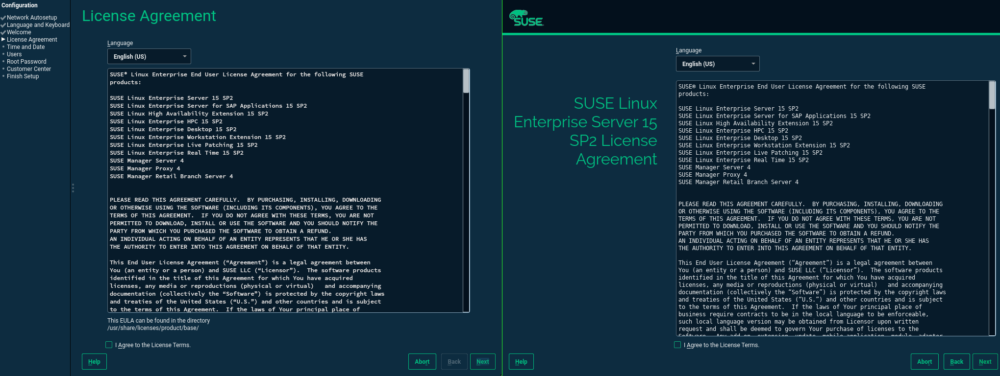

# YaST Installer and First-boot

YaST provides a *first-boot* utility that allows to configure the system during the first boot after the installation. That *first-boot* works as an installer extensions that guides the user through a series of steps.

Although *first-boot* is conceptually received as an installer extension, this part of YaST is frequently forgotten when some re-branding is performed to the SUSE/openSUSE installer. Because of that, currently we do not experience a similar look&feel when we use the YaST installer and the *first-boot*.

## Layout Configuration

YaST installer allows to tweak the windows layout. Basically it allows to show/hide the left sidebar (with the list of installer steps) and the top banner. A control file setting is used to configure it:

~~~
<globals>
   <installation_ui>sidebar</installation_ui>
</globals>
~~~

Currently, YaST only allows to possible layouts:

* Layout including sidebar but without banner (used by openSUSE installer).
* Layout with banner but without sidebar (used by SLE installer).

YaST does not offer any way to configure each layout element separately, and the *sidebar* value must be indicated to activate the openSUSE variant. By default, SLE variant is used.

And what about the *first-boot* layout? For the *first-boot* nothing is configurable at this moment. YaST always runs the *first-boot* with the openSUSE variant (sidebar but no banner).

### Technical details

* To activate the top banner: `UI.SetProductLogo(true)`
  * Every new wizard will take it into account

* To activate the sidebar: `Wizard.OpenNextBackStepsDialog`

* To not activate the sidebar: `Wizard.OpenNextBackDialog`

See https://github.com/yast/yast-installation/blob/master/src/lib/installation/clients/installation.rb#L54.

## Fonts configuration

The YaST installer and the *first-boot* use the same *installer.qss* style-sheet provided by [yast-theme](https://github.com/yast/yast-theme) (SLE) and [openSUSE/branding](https://github.com/openSUSE/branding) (openSUSE). The style-sheet sets the font family to use for different elements (e.g., title of dialogs, etc).

Such fonts should be provided to the system in order to use them. In case of openSUSE, the package *yast2-qt-branding-openSUSE* requires the fonts as dependency, but this does not happen in the *yast2-theme* package used by SLE. This makes the SLE installer and *first-boot* to look slightly different because they are using different fonts for the dialog title (*Raleway* font is not installed in the running system).

Also note that Qt uses the system mono-space font for the `<pre></pre>` blocks (e.g., in the rich-text content of the *License Agreement*). To have a similar look and feel in the installer and *first-boot*, the mono-space font should be set to a specific one. Otherwise, different fonts could be used during installation and first boot. It seems that there is no way to force a font family for *pre* blocks directly in the *qss* style-sheet.

### Technical details

To configure fonts, YaST could provide a *fontconfig* file and then use it only during installation and *first-boot*.

For example, let's say YaST provides the file */usr/share/YaST2/theme/current/fonts/fonts.conf* with the following content:

~~~
<?xml version="1.0"?>
<!DOCTYPE fontconfig SYSTEM "fonts.dtd">

<fontconfig>
  <alias>
    <family>monospace</family>
    <prefer><family>Source Code Pro</family></prefer>
  </alias>
</fontconfig>
~~~

and then, during the installation and *first-boot*, YaST configures the env variable *FONTCONFIG_PATH*:

~~~
FONTCONFIG_PATH=/usr/share/YaST2/theme/current/fonts
~~~

With that, the *Source Code Pro* font would be use in both cases and it would not affect to the target/running system.

## Next Steps

* Decide whether to allow to configure banner and sidebar separately.

* Decide whether to use the same layout for installer and *first-boot*.

* Decide whether to configure mono-space system fonts during installation and *first-boot*.
